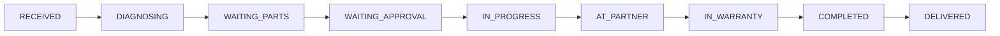

<div align="center">

# 💻 NotebookPro

### Notebook Yedek Parça & Teknik Servis Yönetim Sistemi

[](https://reactjs.org/)
[](https://www.typescriptlang.org/)
[](https://tailwindcss.com/)
[](https://vitejs.dev/)

<p align="center">
  <strong>B2C & B2B destekli, ERP benzeri özelliklere sahip modern e-ticaret platformu</strong>
</p>

---

[🚀 Demo](#-kurulum) • [📖 Dokümantasyon](#-modüller-ve-özellikleri) • [🛠️ Kurulum](#-kurulum) • [📊 Özellikler](#-öne-çıkan-teknik-özellikler)

</div>

---

## 📋 İçindekiler

- [Proje Hakkında](#-proje-hakkında)
- [Teknoloji Stack](#-teknoloji-stack)
- [Mimari Yapı](#-mimari-yapı)
- [Modüller ve Özellikleri](#-modüller-ve-özellikleri)
- [Kurulum](#-kurulum)
- [Kullanım](#-kullanım)
- [Geliştirme Yol Haritası](#-geliştirme-yol-haritası)

---

## 🎯 Proje Hakkında

**NotebookPro**, React + TypeScript ile geliştirilmiş kapsamlı bir **notebook yedek parça satış ve teknik servis yönetim sistemi**dir. 

Hem son kullanıcılar (B2C) hem de bayiler (B2B) için tasarlanmış, Türkiye pazarına özel özelliklere sahip modern bir web uygulamasıdır.

### ✨ Öne Çıkan Özellikler

| Özellik | Açıklama |
|---------|----------|
| 🏷️ **Psikolojik Fiyatlandırma** | Otomatik .90 kuruş formatı |
| 🏢 **B2B Desteği** | Rol bazlı indirim, PDF teklif |
| 🔄 **RMA/Garanti Akışı** | Tedarikçi entegrasyonu |
| 📱 **WhatsApp Entegrasyonu** | Deep link ile destek |
| 🏷️ **QR Kod Etiket** | Servis takip etiketi |
| 💳 **Luhn Doğrulama** | Gerçek kart validasyonu |
| 📱 **Responsive Tasarım** | Mobile-first yaklaşım |

---

## 🛠️ Teknoloji Stack

<table>
<tr>
<td align="center" width="96">

<br>React 18
</td>
<td align="center" width="96">

<br>TypeScript
</td>
<td align="center" width="96">

<br>Tailwind
</td>
<td align="center" width="96">

<br>Vite
</td>
</tr>
</table>

| Katman | Teknoloji |
|--------|-----------|
| **Frontend** | React 18 (TypeScript) |
| **State Management** | React Context API (7 adet Context) |
| **Styling** | Tailwind CSS |
| **Build Tool** | Vite |
| **Routing** | View-based Router (useState) |

---

## 🏗️ Mimari Yapı

```
src/
├── 📁 components/     # 12 adet UI bileşeni
│   ├── AIAssistant.tsx
│   ├── AIPartFinder.tsx
│   ├── ConfirmDialog.tsx     # Onay dialogları
│   ├── CookieBanner.tsx
│   ├── CreditCardVisual.tsx
│   ├── Footer.tsx
│   ├── Navbar.tsx            # Bildirim ikonu eklendi
│   ├── ProductCard.tsx
│   ├── RepairTracker.tsx
│   ├── SEO.tsx
│   └── Toast.tsx             # Toast bildirimleri
│
├── 📁 context/        # 7 adet global state yöneticisi
│   ├── AuthContext.tsx
│   ├── CartContext.tsx
│   ├── CurrencyContext.tsx
│   ├── NotificationContext.tsx  # YENİ - Bildirim sistemi
│   ├── OrderContext.tsx
│   ├── ProductContext.tsx       # Stok hareketleri eklendi
│   └── RepairContext.tsx
│
├── 📁 pages/          # 5 adet sayfa
│   ├── AdminDashboard.tsx    # 10 sekme, ~3700 satır
│   ├── Cart.tsx
│   ├── Checkout.tsx
│   ├── Home.tsx
│   └── Service.tsx
│
├── 📁 types/          # TypeScript tip tanımları
├── 📁 utils/          # Yardımcı fonksiyonlar
└── 📁 data/           # Mock veriler
```

---

## 🔧 Modüller ve Özellikleri

### 👥 1. Kullanıcı Yönetimi

```typescript
// 4 farklı kullanıcı rolü
type UserRole = 'ADMIN' | 'DEALER' | 'TECHNICIAN' | 'CUSTOMER';
```

- ✅ Bayi onay sistemi (`is_approved`)
- ✅ B2B şirket bilgileri (vergi no, ticaret unvanı)
- ✅ Simülasyon modu ile rol değiştirme

### 📦 2. Ürün Yönetimi

- 📍 SKU ve raf lokasyonu takibi
- ⚠️ Kritik stok uyarı sistemi
- 🔗 Çoklu uyumlu model tanımlama
- 💰 B2B bayi indirimi
- ⭐ Ürün yorumları ve puanlama

### 💵 3. Fiyatlandırma Motoru

```
USD Fiyat → Bayi İndirimi → Döviz Çevirimi → KDV (%20) → Psikolojik Fiyat
```

> **Örnek:** $9.99 → Bayi -%15 → ×35₺ → +%20 KDV → **349.90₺**

### 🛒 4. Sepet & Sipariş

- 🛍️ Dinamik sepet yönetimi
- 💳 Taksit hesaplama (3/6 ay + vade farkı)
- 📄 PDF teklif oluşturma (B2B)
- 📊 Sipariş durumu takibi

### 🔧 5. Servis/Tamir Modülü



| Özellik | Açıklama |
|---------|----------|
| 🔄 RMA/Garanti | Tedarikçiye sevk, dış takip kodu |
| 👨‍🔧 Teknisyen Atama | İş yükü dağılımı |
| 🏢 Partner Yönlendirme | Harici servis entegrasyonu |
| 🏷️ QR Etiket | Servis takip etiketi |
| 📸 Fotoğraf Kanıtı | Cihaz durumu belgeleme |

### 💳 6. Ödeme Sistemi

- ✅ Luhn algoritması ile kart doğrulama
- 💳 Kart tipi algılama (Visa, Mastercard, Troy, Amex)
- 🎴 3D görsel kredi kartı animasyonu
- 📊 Taksit tablosu

---

## 🖥️ Sayfalar

| Sayfa | URL | Açıklama |
|-------|-----|----------|
| 🏠 **Home** | `/` | Hero, AI parça bulucu, ürün grid |
| 🔧 **Service** | `/service` | Servis talebi, canlı takip |
| 🛒 **Cart** | `/cart` | Sepet yönetimi, B2B teklif |
| 💳 **Checkout** | `/checkout` | Güvenli ödeme |
| ⚙️ **Admin** | `/admin` | Yönetim paneli (10 sekme) |

### ⚙️ Admin Dashboard Sekmeleri

| Sekme | İkon | Özellikler |
|-------|------|------------|
| **Dashboard** | 📊 | Bugünün özeti, hızlı işlemler, son siparişler/servisler, mini satış grafiği |
| **Ürünler** | 📦 | CRUD, filtreleme, sayfalama, CSV import/export |
| **Bayiler** | 🏢 | Bayi onay sistemi |
| **Servis** | 🔧 | Servis takip, teknisyen atama, RMA/garanti |
| **Siparişler** | 🛒 | Sipariş yönetimi, kargo takip, fatura |
| **Bildirimler** | 🔔 | In-app bildirimler, okundu işaretleme |
| **Raporlar** | 📈 | Satış grafikleri, en çok satanlar, stok/servis raporları |
| **Müşteriler** | 👥 | Müşteri listesi, segmentasyon (VIP/Düzenli/Yeni) |
| **Kampanyalar** | 🏷️ | İndirim kodları, kampanya yönetimi |
| **Ayarlar** | ⚙️ | Döviz, bildirim, firma, sistem ayarları |

---

## 🎨 UI Bileşenleri

| Bileşen | Açıklama |
|---------|----------|
| `Navbar` | Responsive navigasyon, sepet sayacı, rol değiştirici |
| `ProductCard` | Dinamik başlık, B2B fiyat, stok durumu |
| `AIAssistant` | Chatbot - servis/sipariş sorgulama |
| `AIPartFinder` | Yapay zeka destekli parça arama |
| `RepairTracker` | Canlı servis durumu sorgulama |
| `CreditCardVisual` | 3D animasyonlu kart görünümü |
| `CookieBanner` | KVKK uyumlu çerez bildirimi |

---

## 🚀 Kurulum

### Gereksinimler

- Node.js 18+
- npm veya yarn

### Adımlar

```bash
# 1. Repository'yi klonlayın
git clone https://github.com/SiyahKare/notebookpro-logic-simulator.git

# 2. Proje dizinine gidin
cd notebookpro-logic-simulator

# 3. Bağımlılıkları yükleyin
npm install

# 4. Geliştirme sunucusunu başlatın
npm run dev
```

Uygulama varsayılan olarak `http://localhost:5173` adresinde çalışacaktır.

---

## 📖 Kullanım

### Demo Hesapları

| Rol | E-posta | Şifre |
|-----|---------|-------|
| 👑 Admin | admin@notebookpro.com | demo |
| 🏢 Bayi | dealer@company.com | demo |
| 👨‍🔧 Teknisyen | tech@notebookpro.com | demo |

### Rol Değiştirme

Navbar'daki rol seçicisini kullanarak farklı kullanıcı deneyimlerini test edebilirsiniz.

---

## 📊 Mock Veri İstatistikleri

```
📦 5 örnek ürün
👥 5 kullanıcı (admin, teknisyen, bayi)
🏢 2 harici servis partneri
🔧 3 örnek servis kaydı
🔔 6 örnek bildirim
🏷️ 4 örnek kampanya
📊 Demo stok hareketleri
```

---

## 🗺️ Geliştirme Yol Haritası

### ✅ Tamamlanan
- [x] 📊 Admin Panel geliştirmeleri (Dashboard, Raporlar, Müşteriler, vb.)
- [x] 🔔 In-app bildirim sistemi
- [x] 📈 Raporlama & Analytics (Frontend)
- [x] 📥 CSV Import/Export
- [x] 📦 Gelişmiş stok yönetimi
- [x] 🏷️ Promosyon/kampanya yönetimi

### 📝 Planlanıyor
- [ ] 🛣️ React Router entegrasyonu
- [ ] 🔌 Backend API entegrasyonu
- [ ] 🔐 JWT/OAuth authentication
- [ ] 🗄️ Database entegrasyonu
- [ ] 💰 Ödeme gateway entegrasyonu (iyzico, PayTR)
- [ ] 📧 SMS/Email bildirim sistemi (backend)
- [ ] 🌍 Çoklu dil desteği (i18n)

---

## 🇹🇷 Türkiye'ye Özel Özellikler

- 💰 KDV hesaplaması (%20)
- 💳 Troy kart desteği
- 📱 WhatsApp entegrasyonu
- 📋 KVKK uyumlu çerez politikası
- 🏢 Vergi numarası / Ticaret unvanı alanları

---

## 📄 Lisans

Bu proje MIT lisansı altında lisanslanmıştır.

---

<div align="center">

**[⬆ Başa Dön](#-notebookpro)**

Made with ❤️ by [SiyahKare](https://github.com/SiyahKare)

</div>
