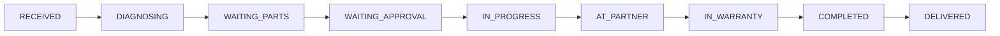

<div align="center">

# 💻 NotebookPro

### Notebook Yedek Parça & Teknik Servis Yönetim Sistemi

[](https://reactjs.org/)
[](https://www.typescriptlang.org/)
[](https://tailwindcss.com/)
[](https://nodejs.org/)
[](https://www.postgresql.org/)
[](https://www.prisma.io/)

<p align="center">
  <strong>B2C & B2B destekli, ERP benzeri özelliklere sahip modern e-ticaret platformu</strong>
</p>

---

[🚀 Demo](#-kurulum) • [📖 Dokümantasyon](#-modüller-ve-özellikleri) • [🛠️ Kurulum](#-kurulum) • [📊 Özellikler](#-öne-çıkan-teknik-özellikler)

</div>

---

## 📋 İçindekiler

- [Proje Hakkında](#-proje-hakkında)
- [Teknoloji Stack](#-teknoloji-stack)
- [Mimari Yapı](#-mimari-yapı)
- [Modüller ve Özellikleri](#-modüller-ve-özellikleri)
- [Kurulum](#-kurulum)
- [Kullanım](#-kullanım)
- [Geliştirme Yol Haritası](#-geliştirme-yol-haritası)

---

## 🎯 Proje Hakkında

**NotebookPro**, React + TypeScript ile geliştirilmiş kapsamlı bir **notebook yedek parça satış ve teknik servis yönetim sistemi**dir. 

Hem son kullanıcılar (B2C) hem de bayiler (B2B) için tasarlanmış, Türkiye pazarına özel özelliklere sahip modern bir web uygulamasıdır.

### ✨ Öne Çıkan Özellikler

| Özellik | Açıklama |
|---------|----------|
| 🏷️ **Psikolojik Fiyatlandırma** | Otomatik .90 kuruş formatı |
| 🏢 **B2B Desteği** | Rol bazlı indirim, PDF teklif |
| 🔄 **RMA/Garanti Akışı** | Tedarikçi entegrasyonu |
| 📱 **WhatsApp Entegrasyonu** | Deep link ile destek |
| 🏷️ **QR Kod Etiket** | Servis takip etiketi |
| 💳 **Luhn Doğrulama** | Gerçek kart validasyonu |
| 📱 **Responsive Tasarım** | Mobile-first yaklaşım |

---

## 🛠️ Teknoloji Stack

<table>
<tr>
<td align="center" width="96">

<br>React 18
</td>
<td align="center" width="96">

<br>TypeScript
</td>
<td align="center" width="96">

<br>Tailwind
</td>
<td align="center" width="96">

<br>Vite
</td>
</tr>
</table>

| Katman | Teknoloji |
|--------|-----------|
| **Frontend** | React 18 (TypeScript) |
| **State Management** | React Context API (11 adet Context) |
| **Styling** | Tailwind CSS |
| **Build Tool** | Vite |
| **Routing** | React Router v6 |
| **HTTP Client** | Axios |
| **Çoklu Dil** | Custom i18n (TR/EN) |
| **Backend** | Node.js + Express |
| **Database** | PostgreSQL 16 |
| **ORM** | Prisma 5 |
| **Authentication** | JWT (Access + Refresh tokens) |
| **Email** | Nodemailer (SMTP / Ethereal) |

---

## 🏗️ Mimari Yapı

```
📦 notebookpro-logic-simulator/
├── 📁 src/                    # Frontend (React)
│   ├── 📁 components/         # 16 UI bileşeni
│   ├── 📁 context/            # 11 Context (API entegreli)
│   ├── 📁 hooks/              # Custom React Hooks
│   ├── 📁 pages/              # 14 sayfa
│   ├── 📁 services/           # 🔗 API client (Axios)
│   │   └── api.ts             # Merkezi API client
│   ├── 📁 types/              # TypeScript definitions
│   ├── 📁 utils/              # Helper functions
│   └── 📁 data/               # Mock data (fallback)
│
└── 📁 server/                 # Backend (Node.js)
    ├── 📁 prisma/
    │   ├── schema.prisma      # 11 model, enum'lar
    │   ├── seed.ts            # Seed data
    │   └── migrations/        # PostgreSQL migrations
    ├── 📁 src/
    │   ├── 📁 config/         # Environment, DB config
    │   ├── 📁 middlewares/    # Auth, Error handling
    │   ├── 📁 routes/         # 9 API route dosyası
    │   │   ├── auth.routes.ts
    │   │   ├── product.routes.ts
    │   │   ├── order.routes.ts
    │   │   ├── repair.routes.ts
    │   │   ├── user.routes.ts
    │   │   ├── notification.routes.ts
    │   │   ├── coupon.routes.ts
    │   │   ├── setting.routes.ts
    │   │   └── email.routes.ts       # 📧 Test endpoint
    │   ├── 📁 services/       # Business logic
    │   │   └── email.service.ts      # 📧 Nodemailer
    │   └── index.ts           # Express server
    └── package.json
```

---

## 🔧 Modüller ve Özellikleri

### 👥 1. Kullanıcı Yönetimi

```typescript
// 4 farklı kullanıcı rolü
type UserRole = 'ADMIN' | 'DEALER' | 'TECHNICIAN' | 'CUSTOMER';
```

- ✅ Bayi onay sistemi (`is_approved`)
- ✅ B2B şirket bilgileri (vergi no, ticaret unvanı)
- ✅ Simülasyon modu ile rol değiştirme

### 📦 2. Ürün Yönetimi

- 📍 SKU ve raf lokasyonu takibi
- ⚠️ Kritik stok uyarı sistemi
- 🔗 Çoklu uyumlu model tanımlama
- 💰 B2B bayi indirimi
- ⭐ Ürün yorumları ve puanlama

### 💵 3. Fiyatlandırma Motoru

```
USD Fiyat → Bayi İndirimi → Döviz Çevirimi → KDV (%20) → Psikolojik Fiyat
```

> **Örnek:** $9.99 → Bayi -%15 → ×35₺ → +%20 KDV → **349.90₺**

### 🛒 4. Sepet & Sipariş

- 🛍️ Dinamik sepet yönetimi
- 💳 Taksit hesaplama (3/6 ay + vade farkı)
- 📄 PDF teklif oluşturma (B2B)
- 📊 Sipariş durumu takibi

### 🔧 5. Servis/Tamir Modülü



| Özellik | Açıklama |
|---------|----------|
| 🔄 RMA/Garanti | Tedarikçiye sevk, dış takip kodu |
| 👨‍🔧 Teknisyen Atama | İş yükü dağılımı |
| 🏢 Partner Yönlendirme | Harici servis entegrasyonu |
| 🏷️ QR Etiket | Servis takip etiketi |
| 📸 Fotoğraf Kanıtı | Cihaz durumu belgeleme |

### 💳 6. Ödeme Sistemi

- ✅ Luhn algoritması ile kart doğrulama
- 💳 Kart tipi algılama (Visa, Mastercard, Troy, Amex)
- 🎴 3D görsel kredi kartı animasyonu
- 📊 Taksit tablosu

---

## 🖥️ Sayfalar

| Sayfa | URL | Açıklama |
|-------|-----|----------|
| 🏠 **Home** | `/` | Hero, AI parça bulucu, ürün grid |
| 🔧 **Service** | `/service` | Servis talebi, canlı takip |
| 🛒 **Cart** | `/cart` | Sepet yönetimi, B2B teklif |
| 💳 **Checkout** | `/checkout` | Güvenli ödeme |
| ⚙️ **Admin** | `/admin` | Yönetim paneli (10 sekme) |

### ⚙️ Admin Dashboard Sekmeleri

| Sekme | İkon | Özellikler |
|-------|------|------------|
| **Dashboard** | 📊 | Bugünün özeti, hızlı işlemler, son siparişler/servisler, mini satış grafiği |
| **Ürünler** | 📦 | CRUD, filtreleme, sayfalama, CSV import/export |
| **Bayiler** | 🏢 | Bayi onay sistemi |
| **Servis** | 🔧 | Servis takip, teknisyen atama, RMA/garanti |
| **Siparişler** | 🛒 | Sipariş yönetimi, kargo takip, fatura |
| **Bildirimler** | 🔔 | In-app bildirimler, okundu işaretleme |
| **Raporlar** | 📈 | Satış grafikleri, en çok satanlar, stok/servis raporları |
| **Müşteriler** | 👥 | Müşteri listesi, segmentasyon (VIP/Düzenli/Yeni) |
| **Kampanyalar** | 🏷️ | İndirim kodları, kampanya yönetimi |
| **Ayarlar** | ⚙️ | Döviz, bildirim, firma, sistem ayarları |

---

## 🎨 UI Bileşenleri

| Bileşen | Açıklama |
|---------|----------|
| `Navbar` | Responsive navigasyon, sepet sayacı, rol değiştirici |
| `ProductCard` | Dinamik başlık, B2B fiyat, stok durumu |
| `AIAssistant` | Chatbot - servis/sipariş sorgulama |
| `AIPartFinder` | Yapay zeka destekli parça arama |
| `RepairTracker` | Canlı servis durumu sorgulama |
| `CreditCardVisual` | 3D animasyonlu kart görünümü |
| `CookieBanner` | KVKK uyumlu çerez bildirimi |

---

## 🚀 Kurulum

### Gereksinimler

- Node.js 18+
- PostgreSQL 16+
- npm veya yarn

### Adımlar

```bash
# 1. Repository'yi klonlayın
git clone https://github.com/SiyahKare/notebookpro-logic-simulator.git
cd notebookpro-logic-simulator

# 2. Frontend bağımlılıklarını yükleyin
npm install

# 3. Backend bağımlılıklarını yükleyin
cd server && npm install && cd ..

# 4. PostgreSQL veritabanı oluşturun
createdb notebookpro

# 5. Prisma migration ve seed
cd server
npx prisma migrate dev --name init
npx prisma db seed
cd ..

# 6. Backend'i başlatın (yeni terminal)
cd server && npm run dev

# 7. Frontend'i başlatın
npm run dev
```

### Çalışan Servisler

| Servis | URL |
|--------|-----|
| Frontend | http://localhost:3000 |
| Backend API | http://localhost:5001 |
| API Docs | http://localhost:5001/api |
| Prisma Studio | `npx prisma studio` |

---

## 📖 Kullanım

### Demo Hesapları (PostgreSQL)

| Rol | E-posta | Şifre |
|-----|---------|-------|
| 👑 Admin | admin@notebookpro.com | admin123 |
| 👨‍🔧 Teknisyen | ahmet@notebookpro.com | tech123 |
| 🏢 Bayi | info@egepc.com | dealer123 |
| 👤 Müşteri | ali@gmail.com | customer123 |

### Demo Modu

Navbar'daki simülasyon butonlarını kullanarak API olmadan demo kullanıcılarla test yapabilirsiniz.

### API Test

```bash
# Health check
curl http://localhost:5001/api/health

# Login
curl -X POST http://localhost:5001/api/auth/login \
  -H "Content-Type: application/json" \
  -d '{"email":"admin@notebookpro.com","password":"admin123"}'

# Ürünler
curl http://localhost:5001/api/products
```

---

## 📊 Veritabanı İstatistikleri

```
🐘 PostgreSQL Database: notebookpro
📦 10 ürün (Screen, Battery, RAM, SSD, Motherboard)
👥 4 kullanıcı (Admin, Technician, Dealer, Customer)
🎫 4 kupon kodu
⚙️ 10 sistem ayarı
📋 11 Prisma model
🔗 8 API route dosyası
```

---

## 🗺️ Geliştirme Yol Haritası

### ✅ Tamamlanan (v3.1.0)
- [x] 📊 Admin Panel geliştirmeleri (Dashboard, Raporlar, Müşteriler, vb.)
- [x] 🔔 In-app bildirim sistemi
- [x] 📈 Raporlama & Analytics (Frontend)
- [x] 📥 CSV Import/Export
- [x] 📦 Gelişmiş stok yönetimi
- [x] 🏷️ Promosyon/kampanya yönetimi
- [x] 🛣️ React Router v6 entegrasyonu
- [x] 🌙 Dark Mode & PWA desteği
- [x] 🌍 Çoklu dil desteği (TR/EN)
- [x] 🔌 **Backend API** (Node.js + Express + Prisma)
- [x] 🐘 **PostgreSQL** veritabanı entegrasyonu
- [x] 🔐 **JWT Authentication** sistemi
- [x] 🔗 **Frontend API entegrasyonu** (Axios)

### 📝 Planlanıyor
- [ ] 💰 Ödeme gateway entegrasyonu (iyzico, PayTR)
- [ ] 📧 E-posta bildirim sistemi (SendGrid)
- [ ] 📱 SMS bildirim sistemi (Netgsm)
- [ ] 🔒 OAuth2 (Google, Apple)
- [ ] 📱 Mobil uygulama (React Native)

---

## 🇹🇷 Türkiye'ye Özel Özellikler

- 💰 KDV hesaplaması (%20)
- 💳 Troy kart desteği
- 📱 WhatsApp entegrasyonu
- 📋 KVKK uyumlu çerez politikası
- 🏢 Vergi numarası / Ticaret unvanı alanları

---

## 📄 Lisans

Bu proje MIT lisansı altında lisanslanmıştır.

---

<div align="center">

**[⬆ Başa Dön](#-notebookpro)**

Made with ❤️ by [SiyahKare](https://github.com/SiyahKare)

</div>
