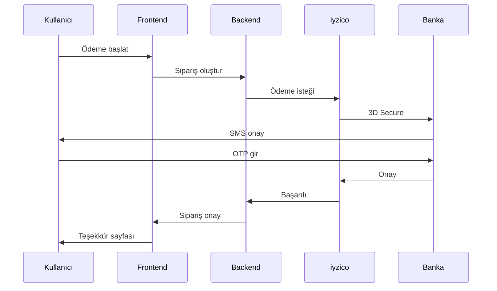

<div align="center">

# 🗺️ NotebookPro Roadmap

### Geliştirme Yol Haritası

</div>

---

## 📅 Genel Bakış

Bu döküman, NotebookPro projesinin planlanan geliştirme aşamalarını ve hedeflerini içermektedir.

---

## 🏁 Faz 1: Temel Altyapı (Tamamlandı ✅)

> **Süre:** 2025 Q1  
> **Durum:** ✅ Tamamlandı

### Hedefler

- [x] React + TypeScript proje yapısı
- [x] Tailwind CSS entegrasyonu
- [x] Context API ile state yönetimi
- [x] Mock veri yapısı
- [x] Temel UI bileşenleri

### Tamamlanan Özellikler

| Özellik | Durum |
|---------|-------|
| Kullanıcı rolleri (Admin, Dealer, Technician, Customer) | ✅ |
| Ürün listeleme ve detay | ✅ |
| Sepet yönetimi | ✅ |
| Checkout akışı | ✅ |
| Servis takip sistemi | ✅ |
| Admin dashboard | ✅ |
| Psikolojik fiyatlandırma | ✅ |
| Kredi kartı validasyonu | ✅ |

---

## ✅ Faz 1.5: Admin Panel Geliştirmeleri (Tamamlandı ✅)

> **Süre:** 2025 Q1 (Aralık)  
> **Durum:** ✅ Tamamlandı

### Hedefler

- [x] Dashboard widget'ları ve hızlı eylemler
- [x] Bildirim merkezi (in-app)
- [x] Raporlama & Analytics (frontend)
- [x] Müşteri yönetimi
- [x] Sistem ayarları
- [x] Excel Import/Export
- [x] Gelişmiş stok yönetimi
- [x] Promosyon/kampanya yönetimi

### Tamamlanan Özellikler

| Özellik | Durum |
|---------|-------|
| Dashboard - Bugünün özeti kartı | ✅ |
| Dashboard - Hızlı işlemler | ✅ |
| Dashboard - Son siparişler/servisler widget'ları | ✅ |
| Dashboard - Mini satış grafiği (son 7 gün) | ✅ |
| Bildirim merkezi - NotificationContext | ✅ |
| Bildirim merkezi - Navbar zil ikonu | ✅ |
| Bildirim merkezi - Dropdown panel | ✅ |
| Raporlar sekmesi - Dönem seçici | ✅ |
| Raporlar sekmesi - Satış grafiği | ✅ |
| Raporlar sekmesi - En çok satanlar | ✅ |
| Raporlar sekmesi - Kategori dağılımı | ✅ |
| Müşteriler sekmesi - Müşteri birleştirme | ✅ |
| Müşteriler sekmesi - Segmentasyon (VIP/Düzenli/Yeni) | ✅ |
| Ayarlar sekmesi - Döviz/Bildirim/Firma ayarları | ✅ |
| Import/Export - CSV export (ürün/sipariş/servis) | ✅ |
| Import/Export - Ürün import | ✅ |
| Stok yönetimi - Stok hareket takibi | ✅ |
| Stok yönetimi - Geçmiş modalı | ✅ |
| Kampanyalar sekmesi - İndirim kodları | ✅ |
| Kampanyalar sekmesi - Kampanya tipleri | ✅ |

---

## ✅ Faz 2: Routing & Navigation (Tamamlandı ✅)

> **Süre:** 2025 Q1 (Aralık)  
> **Durum:** ✅ Tamamlandı

### Hedefler

- [x] React Router v6 entegrasyonu
- [x] Lazy loading ile code splitting
- [x] Protected routes (rol bazlı)
- [x] Breadcrumb navigasyonu
- [x] URL parametreleri ile ürün/servis detay

---

## ✅ Faz 2.5: Kapsamlı Frontend Geliştirmeleri (Tamamlandı ✅)

> **Süre:** 2025 Q1 (Aralık)  
> **Durum:** ✅ Tamamlandı

### Hedefler

- [x] UX iyileştirmeleri ve animasyonlar
- [x] Yeni sayfalar (Profile, Orders, Favorites, Contact)
- [x] Ürün kataloğu genişletmesi (20 ürün)
- [x] AI Asistan geliştirmeleri
- [x] Çoklu dil desteği (TR/EN)
- [x] E-ticaret özellikleri (Kupon, Hediye paketi, Fatura)

### Tamamlanan Özellikler

| Kategori | Özellik | Durum |
|----------|---------|-------|
| **UX** | AnimatedComponents (FadeIn, SlideIn, Counter) | ✅ |
| **UX** | useInfiniteScroll Hook | ✅ |
| **UX** | useFuzzySearch Hook | ✅ |
| **UX** | CSS Animasyonları (shimmer, ripple, bounce) | ✅ |
| **Sayfalar** | Profile - Kullanıcı profil yönetimi | ✅ |
| **Sayfalar** | Orders - Sipariş geçmişi | ✅ |
| **Sayfalar** | Favorites - Favori ürünler | ✅ |
| **Sayfalar** | Contact - İletişim formu + SSS | ✅ |
| **Context** | FavoritesContext - Favori yönetimi | ✅ |
| **Context** | LanguageContext - TR/EN dil desteği | ✅ |
| **Context** | CouponContext - Kupon sistemi | ✅ |
| **Ürünler** | 15 yeni ürün (RAM, Motherboard, vb.) | ✅ |
| **AI** | Arıza Teşhis Wizard (20+ sonuç) | ✅ |
| **AI** | Ürün öneri sistemi | ✅ |
| **AI** | Quick Actions panel | ✅ |
| **i18n** | 100+ çeviri anahtarı | ✅ |
| **i18n** | Otomatik dil algılama | ✅ |
| **E-ticaret** | 5 kupon kodu | ✅ |
| **E-ticaret** | Hediye paketi seçeneği | ✅ |
| **E-ticaret** | ShippingTracker bileşeni | ✅ |
| **E-ticaret** | Invoice bileşeni | ✅ |

### Tamamlanan Özellikler

| Özellik | Durum |
|---------|-------|
| BrowserRouter entegrasyonu | ✅ |
| Lazy loading (Suspense) | ✅ |
| ProtectedRoute komponenti | ✅ |
| Ürün listesi sayfası (/products) | ✅ |
| Ürün detay sayfası (/product/:id) | ✅ |
| Bayi Dashboard (/dealer) | ✅ |
| Teknisyen Dashboard (/technician) | ✅ |
| 404 Not Found sayfası | ✅ |
| Dark Mode desteği | ✅ |
| PWA desteği | ✅ |

### Teknik Detaylar

```typescript
// Planlanan route yapısı
const routes = [
  { path: '/', element: <Home /> },
  { path: '/products/:category', element: <Products /> },
  { path: '/product/:id', element: <ProductDetail /> },
  { path: '/cart', element: <Cart /> },
  { path: '/checkout', element: <Checkout />, protected: true },
  { path: '/service', element: <Service /> },
  { path: '/service/:trackingCode', element: <ServiceDetail /> },
  { path: '/admin/*', element: <AdminDashboard />, roles: ['ADMIN'] },
  { path: '/dealer/*', element: <DealerDashboard />, roles: ['DEALER'] },
];
```

---

## ✅ Faz 3: Backend Entegrasyonu (Tamamlandı ✅)

> **Süre:** 2025 Q1 (Aralık)  
> **Durum:** ✅ Tamamlandı

### Hedefler

- [x] RESTful API tasarımı
- [x] Node.js + Express backend
- [x] PostgreSQL veritabanı
- [x] Prisma ORM entegrasyonu
- [x] Frontend API entegrasyonu

### Tamamlanan API Endpoints

```
Auth ✅
├── POST   /api/auth/login          # JWT login
├── POST   /api/auth/register       # Yeni kullanıcı
├── POST   /api/auth/refresh        # Token yenileme
├── POST   /api/auth/logout         # Çıkış
├── GET    /api/auth/me             # Mevcut kullanıcı
└── PUT    /api/auth/password       # Şifre değiştirme

Products ✅
├── GET    /api/products            # Filtreleme, sayfalama
├── GET    /api/products/:id        # Ürün detay
├── POST   /api/products (admin)    # Yeni ürün
├── PUT    /api/products/:id        # Güncelleme
├── DELETE /api/products/:id        # Silme
├── POST   /api/products/:id/stock  # Stok hareketi
├── POST   /api/products/:id/favorite
└── POST   /api/products/:id/review

Orders ✅
├── GET    /api/orders
├── GET    /api/orders/:id
├── POST   /api/orders
├── PATCH  /api/orders/:id/status
└── POST   /api/orders/:id/cancel

Repairs ✅
├── GET    /api/repairs
├── GET    /api/repairs/track/:code # Public
├── POST   /api/repairs
├── PATCH  /api/repairs/:id/status
└── POST   /api/repairs/:id/parts

Users, Notifications, Coupons, Settings ✅
```

### Database Schema

| Model | Açıklama |
|-------|----------|
| User | Kullanıcılar, roller, adresler |
| Product | Ürünler, uyumlu modeller |
| Order | Siparişler, order items |
| Repair | Servis kayıtları, parçalar |
| Notification | Bildirimler |
| Coupon | Kupon kodları |
| Setting | Sistem ayarları |

---

## ✅ Faz 4: Authentication & Security (Tamamlandı ✅)

> **Süre:** 2025 Q1 (Aralık)  
> **Durum:** ✅ Tamamlandı

### Hedefler

- [x] JWT token authentication
- [x] Refresh token mekanizması
- [ ] OAuth2 entegrasyonu (Google, Apple)
- [ ] Two-factor authentication (2FA)
- [x] Rate limiting
- [x] CORS yapılandırması
- [x] Input sanitization (express-validator)

### Güvenlik Kontrol Listesi

| Özellik | Durum |
|---------|-------|
| JWT Authentication | ✅ Tamamlandı |
| Password hashing (bcrypt) | ✅ Tamamlandı |
| HTTPS zorunluluğu | 📝 Production'da |
| SQL Injection koruması (Prisma) | ✅ Tamamlandı |
| XSS koruması (Helmet) | ✅ Tamamlandı |
| CSRF token | 📝 Planlanıyor |
| Rate limiting | ✅ Tamamlandı |
| 2FA | 📝 Planlanıyor |

---

## 💳 Faz 5: Ödeme Entegrasyonu (Planlandı 📝)

> **Süre:** 2025 Q2-Q3  
> **Durum:** 📝 Planlandı

### Hedefler

- [ ] iyzico entegrasyonu
- [ ] PayTR alternatif entegrasyonu
- [ ] 3D Secure zorunluluğu
- [ ] Taksit seçenekleri (banka bazlı)
- [ ] Havale/EFT seçeneği
- [ ] Fatura kesimi entegrasyonu

### Ödeme Akışı



---

## 📧 Faz 6: Bildirim Sistemi (Kısmen Tamamlandı 🟡)

> **Süre:** 2025 Q3  
> **Durum:** 🟡 Kısmen Tamamlandı

### Hedefler

- [ ] E-posta bildirimleri (SendGrid/Mailgun)
- [ ] SMS bildirimleri (Netgsm/İleti Merkezi)
- [ ] Push notifications (FCM)
- [x] In-app bildirimler ✅ **(Tamamlandı - Aralık 2025)**
- [x] AI Asistan bildirimleri ✅ **(Tamamlandı - Aralık 2025)**
- [ ] WhatsApp Business API

### Bildirim Tetikleyicileri

| Olay | E-posta | SMS | Push |
|------|---------|-----|------|
| Sipariş onayı | ✅ | ✅ | ✅ |
| Kargo çıkışı | ✅ | ✅ | ✅ |
| Servis durumu değişikliği | ✅ | ✅ | ✅ |
| Stok uyarısı (B2B) | ✅ | ❌ | ✅ |
| Fiyat değişikliği | ✅ | ❌ | ✅ |
| Bayi onayı | ✅ | ✅ | ❌ |

---

## 📊 Faz 7: Raporlama & Analytics (Kısmen Tamamlandı 🟡)

> **Süre:** 2025 Q3-Q4  
> **Durum:** 🟡 Kısmen Tamamlandı (Frontend Hazır)

### Hedefler

- [x] Satış raporları (günlük/haftalık/aylık) ✅ **(Frontend - Aralık 2025)**
- [x] Stok raporları ✅ **(Frontend - Aralık 2025)**
- [x] Servis performans metrikleri ✅ **(Frontend - Aralık 2025)**
- [ ] Bayi performans dashboard'u
- [x] Finansal özet raporları ✅ **(Frontend - Aralık 2025)**
- [ ] Google Analytics 4 entegrasyonu
- [ ] Custom event tracking

### Tamamlanan Dashboard Grafikleri (Frontend)

- ✅ 📈 Satış trendi grafiği (bar chart)
- ✅ 📊 Kategori bazlı satış dağılımı
- ✅ 📉 Stok durumu kartları
- 📝 🗺️ Bölgesel satış haritası (planlanıyor)
- ✅ ⏱️ Servis durumu dağılımı

---

## 🌍 Faz 8: Çoklu Dil & Lokalizasyon (Planlandı 📝)

> **Süre:** 2025 Q4  
> **Durum:** 📝 Planlandı

### Hedefler

- [ ] i18next entegrasyonu
- [ ] Türkçe (varsayılan)
- [ ] İngilizce
- [ ] Almanca (Avrupa pazarı)
- [ ] Arapça (Ortadoğu pazarı)
- [ ] RTL desteği

### Dil Dosyası Yapısı

```
locales/
├── tr/
│   ├── common.json
│   ├── products.json
│   ├── checkout.json
│   └── errors.json
├── en/
│   └── ...
├── de/
│   └── ...
└── ar/
    └── ...
```

---

## 📱 Faz 9: Mobil Uygulama (Gelecek 🔮)

> **Süre:** 2026 Q1  
> **Durum:** 🔮 Gelecek Plan

### Hedefler

- [ ] React Native ile cross-platform uygulama
- [ ] iOS App Store yayını
- [ ] Google Play Store yayını
- [ ] Offline modu
- [ ] Barkod/QR okuyucu
- [ ] Push notification desteği

---

## 🤖 Faz 10: AI & Otomasyon (Kısmen Tamamlandı 🟡)

> **Süre:** 2026 Q2  
> **Durum:** 🟡 Kısmen Tamamlandı (Frontend)

### Hedefler

- [x] AI destekli parça önerisi ✅ **(Frontend - Aralık 2025)**
- [ ] Chatbot geliştirme (GPT entegrasyonu)
- [ ] Otomatik fiyatlandırma
- [ ] Talep tahmini
- [x] Arıza teşhis asistanı ✅ **(Frontend - Aralık 2025)**
- [ ] Görsel parça tanıma (computer vision)

---

## 📌 Öncelik Matrisi

```
                    YÜKSEK ETKİ
                         │
    ┌────────────────────┼────────────────────┐
    │                    │                    │
    │   💳 Ödeme         │   ✅ Backend       │
    │   📧 E-posta/SMS   │   ✅ Auth          │
    │                    │   ✅ Routing       │
────┼────────────────────┼────────────────────┼──── DÜŞÜK/YÜKSEK ÇABA
    │                    │                    │
    │   📱 Mobil         │   ✅ i18n          │
    │   🔒 OAuth2        │   ✅ Raporlama     │
    │                    │                    │
    └────────────────────┼────────────────────┘
                         │
                    DÜŞÜK ETKİ
```

---

## 🏆 Başarı Metrikleri

| Metrik | Hedef | Durum |
|--------|-------|-------|
| Backend API | Çalışır | ✅ Tamamlandı |
| PostgreSQL | Çalışır | ✅ Tamamlandı |
| JWT Auth | Çalışır | ✅ Tamamlandı |
| Frontend API | Entegre | ✅ Tamamlandı |
| Sayfa yüklenme | < 2 saniye | ✅ Tamamlandı |
| API yanıt süresi | < 200ms | ✅ Tamamlandı |

---

## 📊 Proje İstatistikleri (v3.1.0)

| Kategori | Sayı |
|----------|------|
| Frontend Sayfalar | 14 |
| React Context | 11 |
| UI Bileşenleri | 16 |
| Custom Hooks | 2 |
| Backend Routes | 8 |
| Prisma Models | 11 |
| API Endpoints | 40+ |
| PostgreSQL Tables | 15+ |

---

<div align="center">

**Son Güncelleme:** 5 Aralık 2025  
**Versiyon:** 3.1.0

[← Ana Sayfa](README.md) • [Changelog →](CHANGELOG.md)

</div>

