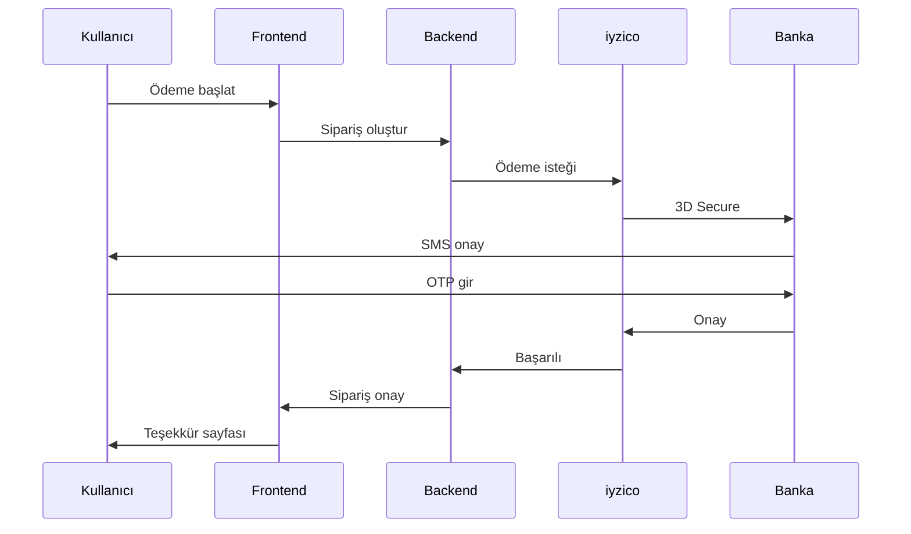

<div align="center">

# 🗺️ NotebookPro Roadmap

### Geliştirme Yol Haritası

</div>

---

## 📅 Genel Bakış

Bu döküman, NotebookPro projesinin planlanan geliştirme aşamalarını ve hedeflerini içermektedir.

---

## 🏁 Faz 1: Temel Altyapı (Tamamlandı ✅)

> **Süre:** 2024 Q4  
> **Durum:** ✅ Tamamlandı

### Hedefler

- [x] React + TypeScript proje yapısı
- [x] Tailwind CSS entegrasyonu
- [x] Context API ile state yönetimi
- [x] Mock veri yapısı
- [x] Temel UI bileşenleri

### Tamamlanan Özellikler

| Özellik | Durum |
|---------|-------|
| Kullanıcı rolleri (Admin, Dealer, Technician, Customer) | ✅ |
| Ürün listeleme ve detay | ✅ |
| Sepet yönetimi | ✅ |
| Checkout akışı | ✅ |
| Servis takip sistemi | ✅ |
| Admin dashboard | ✅ |
| Psikolojik fiyatlandırma | ✅ |
| Kredi kartı validasyonu | ✅ |

---

## ✅ Faz 1.5: Admin Panel Geliştirmeleri (Tamamlandı ✅)

> **Süre:** 2024 Q4 (Aralık)  
> **Durum:** ✅ Tamamlandı

### Hedefler

- [x] Dashboard widget'ları ve hızlı eylemler
- [x] Bildirim merkezi (in-app)
- [x] Raporlama & Analytics (frontend)
- [x] Müşteri yönetimi
- [x] Sistem ayarları
- [x] Excel Import/Export
- [x] Gelişmiş stok yönetimi
- [x] Promosyon/kampanya yönetimi

### Tamamlanan Özellikler

| Özellik | Durum |
|---------|-------|
| Dashboard - Bugünün özeti kartı | ✅ |
| Dashboard - Hızlı işlemler | ✅ |
| Dashboard - Son siparişler/servisler widget'ları | ✅ |
| Dashboard - Mini satış grafiği (son 7 gün) | ✅ |
| Bildirim merkezi - NotificationContext | ✅ |
| Bildirim merkezi - Navbar zil ikonu | ✅ |
| Bildirim merkezi - Dropdown panel | ✅ |
| Raporlar sekmesi - Dönem seçici | ✅ |
| Raporlar sekmesi - Satış grafiği | ✅ |
| Raporlar sekmesi - En çok satanlar | ✅ |
| Raporlar sekmesi - Kategori dağılımı | ✅ |
| Müşteriler sekmesi - Müşteri birleştirme | ✅ |
| Müşteriler sekmesi - Segmentasyon (VIP/Düzenli/Yeni) | ✅ |
| Ayarlar sekmesi - Döviz/Bildirim/Firma ayarları | ✅ |
| Import/Export - CSV export (ürün/sipariş/servis) | ✅ |
| Import/Export - Ürün import | ✅ |
| Stok yönetimi - Stok hareket takibi | ✅ |
| Stok yönetimi - Geçmiş modalı | ✅ |
| Kampanyalar sekmesi - İndirim kodları | ✅ |
| Kampanyalar sekmesi - Kampanya tipleri | ✅ |

---

## 🚧 Faz 2: Routing & Navigation (Devam Ediyor 🔄)

> **Süre:** 2025 Q1  
> **Durum:** 🔄 Devam Ediyor

### Hedefler

- [ ] React Router v6 entegrasyonu
- [ ] Lazy loading ile code splitting
- [ ] Protected routes (rol bazlı)
- [ ] Breadcrumb navigasyonu
- [ ] URL parametreleri ile ürün/servis detay

### Teknik Detaylar

```typescript
// Planlanan route yapısı
const routes = [
  { path: '/', element: <Home /> },
  { path: '/products/:category', element: <Products /> },
  { path: '/product/:id', element: <ProductDetail /> },
  { path: '/cart', element: <Cart /> },
  { path: '/checkout', element: <Checkout />, protected: true },
  { path: '/service', element: <Service /> },
  { path: '/service/:trackingCode', element: <ServiceDetail /> },
  { path: '/admin/*', element: <AdminDashboard />, roles: ['ADMIN'] },
  { path: '/dealer/*', element: <DealerDashboard />, roles: ['DEALER'] },
];
```

---

## 📋 Faz 3: Backend Entegrasyonu (Planlandı 📝)

> **Süre:** 2025 Q1-Q2  
> **Durum:** 📝 Planlandı

### Hedefler

- [ ] RESTful API tasarımı
- [ ] Node.js + Express backend
- [ ] PostgreSQL veritabanı
- [ ] Prisma ORM entegrasyonu
- [ ] API dokümantasyonu (Swagger)

### Planlanan API Endpoints

```
Auth
├── POST   /api/auth/login
├── POST   /api/auth/register
├── POST   /api/auth/refresh
└── POST   /api/auth/logout

Products
├── GET    /api/products
├── GET    /api/products/:id
├── POST   /api/products (admin)
├── PUT    /api/products/:id (admin)
└── DELETE /api/products/:id (admin)

Orders
├── GET    /api/orders
├── GET    /api/orders/:id
├── POST   /api/orders
└── PUT    /api/orders/:id/status

Repairs
├── GET    /api/repairs
├── GET    /api/repairs/:trackingCode
├── POST   /api/repairs
└── PUT    /api/repairs/:id/status
```

---

## 🔐 Faz 4: Authentication & Security (Planlandı 📝)

> **Süre:** 2025 Q2  
> **Durum:** 📝 Planlandı

### Hedefler

- [ ] JWT token authentication
- [ ] Refresh token mekanizması
- [ ] OAuth2 entegrasyonu (Google, Apple)
- [ ] Two-factor authentication (2FA)
- [ ] Rate limiting
- [ ] CORS yapılandırması
- [ ] Input sanitization

### Güvenlik Kontrol Listesi

| Özellik | Öncelik |
|---------|---------|
| JWT Authentication | 🔴 Yüksek |
| Password hashing (bcrypt) | 🔴 Yüksek |
| HTTPS zorunluluğu | 🔴 Yüksek |
| SQL Injection koruması | 🔴 Yüksek |
| XSS koruması | 🔴 Yüksek |
| CSRF token | 🟡 Orta |
| Rate limiting | 🟡 Orta |
| 2FA | 🟢 Düşük |

---

## 💳 Faz 5: Ödeme Entegrasyonu (Planlandı 📝)

> **Süre:** 2025 Q2-Q3  
> **Durum:** 📝 Planlandı

### Hedefler

- [ ] iyzico entegrasyonu
- [ ] PayTR alternatif entegrasyonu
- [ ] 3D Secure zorunluluğu
- [ ] Taksit seçenekleri (banka bazlı)
- [ ] Havale/EFT seçeneği
- [ ] Fatura kesimi entegrasyonu

### Ödeme Akışı



---

## 📧 Faz 6: Bildirim Sistemi (Kısmen Tamamlandı 🟡)

> **Süre:** 2025 Q3  
> **Durum:** 🟡 Kısmen Tamamlandı

### Hedefler

- [ ] E-posta bildirimleri (SendGrid/Mailgun)
- [ ] SMS bildirimleri (Netgsm/İleti Merkezi)
- [ ] Push notifications (FCM)
- [x] In-app bildirimler ✅ **(Tamamlandı - Aralık 2024)**
- [ ] WhatsApp Business API

### Bildirim Tetikleyicileri

| Olay | E-posta | SMS | Push |
|------|---------|-----|------|
| Sipariş onayı | ✅ | ✅ | ✅ |
| Kargo çıkışı | ✅ | ✅ | ✅ |
| Servis durumu değişikliği | ✅ | ✅ | ✅ |
| Stok uyarısı (B2B) | ✅ | ❌ | ✅ |
| Fiyat değişikliği | ✅ | ❌ | ✅ |
| Bayi onayı | ✅ | ✅ | ❌ |

---

## 📊 Faz 7: Raporlama & Analytics (Kısmen Tamamlandı 🟡)

> **Süre:** 2025 Q3-Q4  
> **Durum:** 🟡 Kısmen Tamamlandı (Frontend Hazır)

### Hedefler

- [x] Satış raporları (günlük/haftalık/aylık) ✅ **(Frontend - Aralık 2024)**
- [x] Stok raporları ✅ **(Frontend - Aralık 2024)**
- [x] Servis performans metrikleri ✅ **(Frontend - Aralık 2024)**
- [ ] Bayi performans dashboard'u
- [x] Finansal özet raporları ✅ **(Frontend - Aralık 2024)**
- [ ] Google Analytics 4 entegrasyonu
- [ ] Custom event tracking

### Tamamlanan Dashboard Grafikleri (Frontend)

- ✅ 📈 Satış trendi grafiği (bar chart)
- ✅ 📊 Kategori bazlı satış dağılımı
- ✅ 📉 Stok durumu kartları
- 📝 🗺️ Bölgesel satış haritası (planlanıyor)
- ✅ ⏱️ Servis durumu dağılımı

---

## 🌍 Faz 8: Çoklu Dil & Lokalizasyon (Planlandı 📝)

> **Süre:** 2025 Q4  
> **Durum:** 📝 Planlandı

### Hedefler

- [ ] i18next entegrasyonu
- [ ] Türkçe (varsayılan)
- [ ] İngilizce
- [ ] Almanca (Avrupa pazarı)
- [ ] Arapça (Ortadoğu pazarı)
- [ ] RTL desteği

### Dil Dosyası Yapısı

```
locales/
├── tr/
│   ├── common.json
│   ├── products.json
│   ├── checkout.json
│   └── errors.json
├── en/
│   └── ...
├── de/
│   └── ...
└── ar/
    └── ...
```

---

## 📱 Faz 9: Mobil Uygulama (Gelecek 🔮)

> **Süre:** 2026 Q1  
> **Durum:** 🔮 Gelecek Plan

### Hedefler

- [ ] React Native ile cross-platform uygulama
- [ ] iOS App Store yayını
- [ ] Google Play Store yayını
- [ ] Offline modu
- [ ] Barkod/QR okuyucu
- [ ] Push notification desteği

---

## 🤖 Faz 10: AI & Otomasyon (Gelecek 🔮)

> **Süre:** 2026 Q2  
> **Durum:** 🔮 Gelecek Plan

### Hedefler

- [ ] AI destekli parça önerisi
- [ ] Chatbot geliştirme (GPT entegrasyonu)
- [ ] Otomatik fiyatlandırma
- [ ] Talep tahmini
- [ ] Arıza teşhis asistanı
- [ ] Görsel parça tanıma (computer vision)

---

## 📌 Öncelik Matrisi

```
                    YÜKSEK ETKİ
                         │
    ┌────────────────────┼────────────────────┐
    │                    │                    │
    │   📝 Backend       │   🔐 Auth          │
    │   💳 Ödeme         │   🚧 Routing       │
    │                    │                    │
────┼────────────────────┼────────────────────┼──── DÜŞÜK/YÜKSEK ÇABA
    │                    │                    │
    │   📧 Bildirim      │   🌍 i18n          │
    │   📊 Raporlama     │   📱 Mobil         │
    │                    │                    │
    └────────────────────┼────────────────────┘
                         │
                    DÜŞÜK ETKİ
```

---

## 🏆 Başarı Metrikleri

| Metrik | Hedef | Tarih |
|--------|-------|-------|
| Sayfa yüklenme süresi | < 2 saniye | Q1 2025 |
| Lighthouse skoru | > 90 | Q1 2025 |
| API yanıt süresi | < 200ms | Q2 2025 |
| Uptime | %99.9 | Q2 2025 |
| Mobil uyumluluk | %100 | Q1 2025 |

---

<div align="center">

**Son Güncelleme:** Aralık 2024

[← Ana Sayfa](README.md) • [Changelog →](CHANGELOG.md)

</div>

